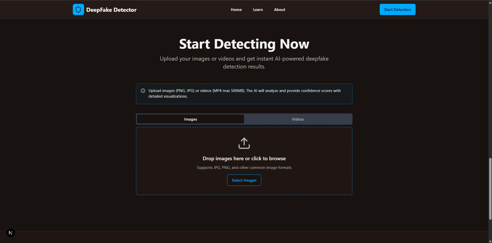
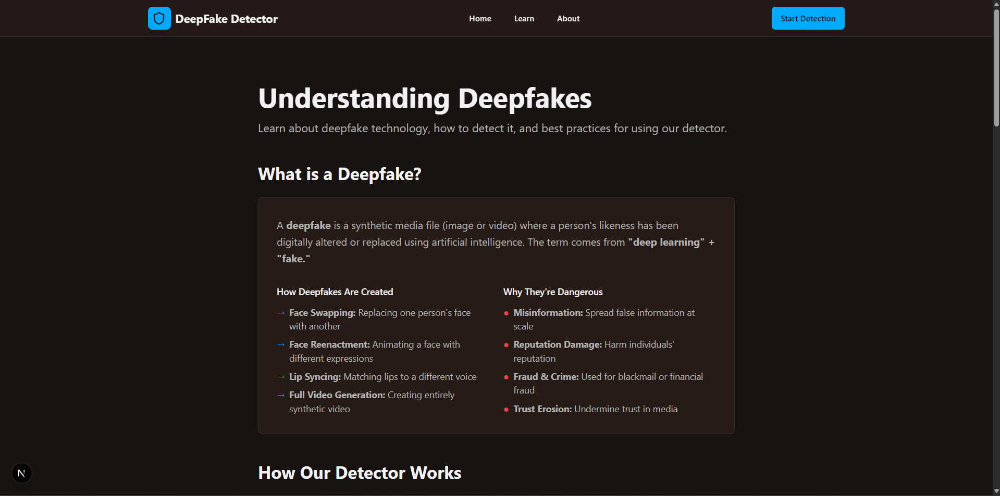
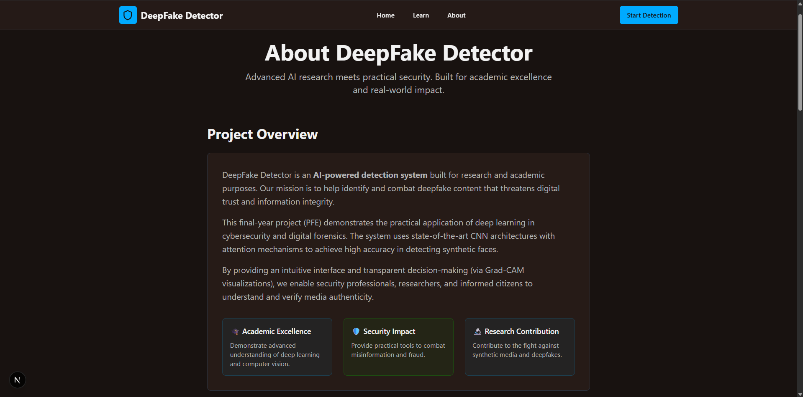
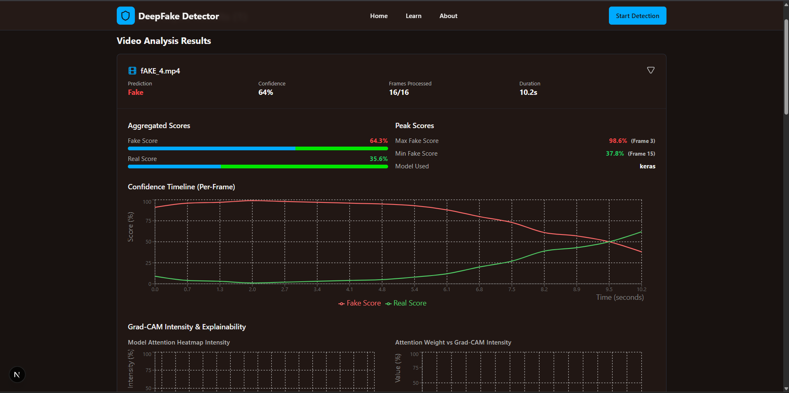
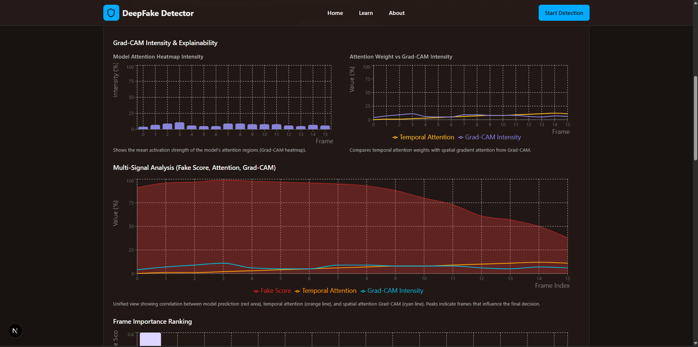
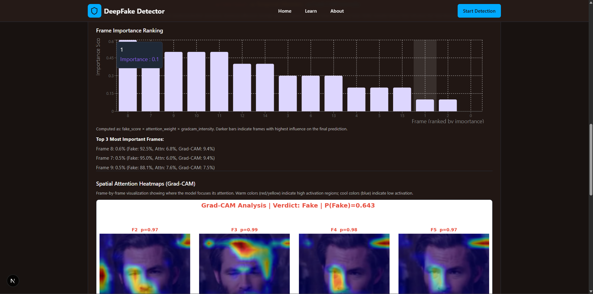
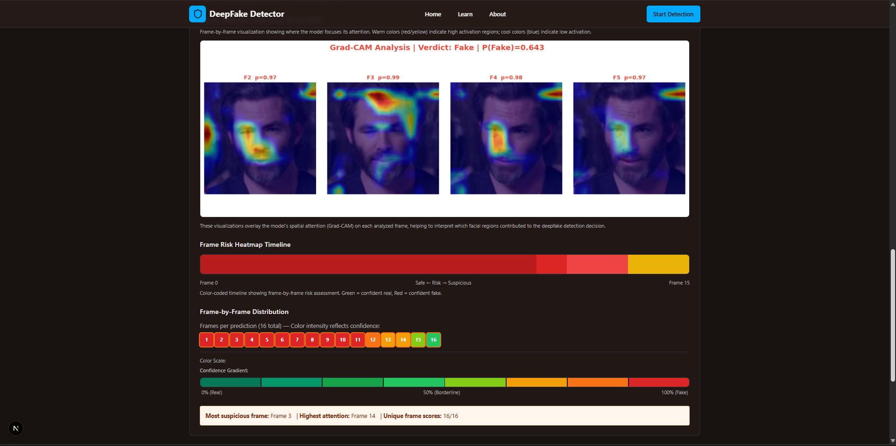

# 🧠 Deepfake Detection Web Application

A full-stack AI-powered web application designed to detect deepfake images and videos using advanced deep learning models. The system integrates a modern web interface with a Python backend to provide fast and reliable predictions.

---

## 🚀 Features

* 🔍 Deepfake detection for images
* 🎥 Video authenticity analysis
* ⚡ Fast REST API backend
* 🌐 Interactive and responsive web interface
* 📊 Clear prediction results

---

## 🏗️ System Architecture

The application follows a three-layer architecture:

1. **Frontend (Next.js)**

   * User interface
   * Sends HTTP requests to backend

2. **Backend (Python API)**

   * Handles requests
   * Loads ML models
   * Returns predictions

3. **Machine Learning Models**

   * Image classification model
   * Video analysis model

---

## 📁 Project Structure

```
Deep_Fake_Detection_APPLICATION_WEB/

├── app/                     # Next.js app (routing & pages)
├── components/              # UI components
├── public/                  # Static files
├── styles/                  # CSS

├── backend/                 # Python backend
│   ├── main.py              # API entry point
│   ├── model_handler.py     # ML logic
│   └── requirements.txt

├── docs/                    # Documentation
│   └── How_To_Run_Application_Web.md

├── assets/                  # Images & screenshots
│   └── interface.png

├── package.json
├── next.config.js
├── README.md
└── .gitignore
```

---

## 📋 Prerequisites

Make sure you have installed:

* Node.js (v18 or higher)
* Python (3.12 recommended)
* pip
* venv

---

## ⚙️ Installation & Setup

### 🌐 Frontend

```bash
npm install
npm run dev
```

👉 Runs on: http://localhost:3000

---

### 🧠 Backend

```bash
cd backend
python -m venv venv
```

#### Activate environment

**Windows**

```bash
venv\Scripts\activate
```

**Linux / macOS**

```bash
source venv/bin/activate
```

#### Install dependencies

```bash
pip install -r requirements.txt
```

#### Run server

```bash
python main.py
```

👉 Runs on: http://localhost:5000

---

## 🤖 Machine Learning Models

The application uses two pre-trained models:

* `image_model.keras` → Detects manipulated images
* `video_model.keras` → Analyzes videos

📥 Download models:
https://drive.google.com/file/d/1F2y1x0fB-7RPLPnIFsU92wSAVinzPahM/view?usp=sharing

📂 Place them in:

```
backend/models/
```

Expected structure:

```
backend/
└── models/
    ├── image_model.keras
    └── video_model.keras
```

---

## ▶️ Running the Application

Start in this order:

1. Backend → `python main.py`
2. Frontend → `npm run dev`
3. Open → http://localhost:3000

---

## 📸 Application Screens

### 🖥️ Main Interface


### 📤 Upload Page


### 📚 Learn Page


### ℹ️ About Page


### 🎬 Video Prediction Example

| Step 1 | Step 2 |
|--------|--------|
|  |  |

| Step 3 | Final Result |
|--------|-------------|
|  |  |


## 🛠️ Troubleshooting

| Issue                | Solution                          |
| -------------------- | --------------------------------- |
| Missing modules      | `pip install -r requirements.txt` |
| Wrong Python version | Use Python 3.12                   |
| Models not found     | Check `backend/models/`           |
| Port already in use  | Change port or stop process       |

---


## ⚠️ Important Notes

* Model files are not included in the repository (large size)
* Always activate the virtual environment
* Start backend before frontend

---

## 👨‍💻 Author

**ACHRAF EL BOUMASHOULI**

Master Student in Artificial Intelligence & Data Science | Passionate about Machine Learning and AI Applications
---

## 📜 License

This project is for academic and educational purposes.

---

## ⭐ Support

If you like this project, feel free to give it a star on GitHub ⭐
