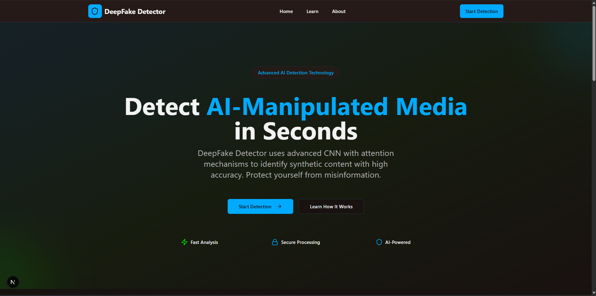

# 🧠 Deepfake Detection Web Application

A full-stack AI-powered web application designed to detect deepfake images and videos using advanced deep learning techniques. The system combines a Python-based backend for model inference with a modern and interactive Next.js frontend.

---

## 🚀 Features

* 🔍 Detect manipulated (deepfake) images
* 🎥 Analyze videos for deepfake content
* ⚡ Fast and efficient backend API
* 🌐 Clean and responsive web interface
* 📊 Clear prediction results and feedback
* 🧩 Modular and scalable architecture

---

## 🏗️ Tech Stack

### Frontend

* Next.js
* React
* Tailwind CSS

### Backend

* Python
* Flask 

### AI / Machine Learning

* Deep Learning model for deepfake detection
* Image & video processing

---

## 📁 Project Structure

```
Deep_Fake_Detection_APPLICATION_WEB/

├── app/                     # Next.js app directory (routing, pages)
├── components/              # Reusable UI components
├── public/                  # Static assets
├── styles/                  # CSS / styling files

├── backend/                 # Python backend (API + ML model)
│   ├── main.py              # Main server entry point
│   ├── model_handler.py     # Model loading & prediction logic
│   └── requirements.txt     # Python dependencies

├── docs/                    # Documentation files
│   └── How_To_Run_Application_Web.md

├── assets/                  # Images & screenshots
│   └── interface.png

├── package.json             # Frontend dependencies
├── next.config.js           # Next.js configuration
├── README.md
└── .gitignore
```


---

## ⚙️ Installation & Setup

### 1. Clone the Repository

```bash
git clone https://github.com/your-username/deepfake-detection-web-app.git
cd deepfake-detection-web-app
```

---

### 2. Backend Setup

```bash
cd backend
python -m venv venv
./venv/Scripts/Activate.ps1
pip install -r requirements.txt
python main.py
```

The backend server will start locally (e.g., http://127.0.0.1:5000).

---

### 3. Frontend Setup

```bash
npm install
npm run dev
```

The frontend will be available at:
http://localhost:3000

---

## 🔌 API Endpoints

| Endpoint           | Description               |
| ------------------ | ------------------------- |
| /api/predict       | Detect deepfake in images |
| /api/predict-video | Detect deepfake in videos |

---

## 📸 Screenshots


```markdown

```

---

## 🧪 How It Works

1. User uploads an image or video
2. Frontend sends the file to the backend API
3. Backend processes the input using the trained model
4. Prediction (Real / Fake) is returned
5. Result is displayed in the UI

---

## 📌 Future Improvements

* 🔄 Improve model accuracy
* ☁️ Deploy on cloud (AWS / Vercel / Render)
* 🐳 Add Docker support
* 🔐 User authentication system

---

## 👨‍💻 Author

**ACHRAF EL BOUMASHOULI**

Master Student in Artificial Intelligence & Data Science | Passionate about Machine Learning and AI Applications
---

## 📜 License

This project is for academic and educational purposes.

---

## ⭐ Support

If you like this project, feel free to give it a star on GitHub ⭐
